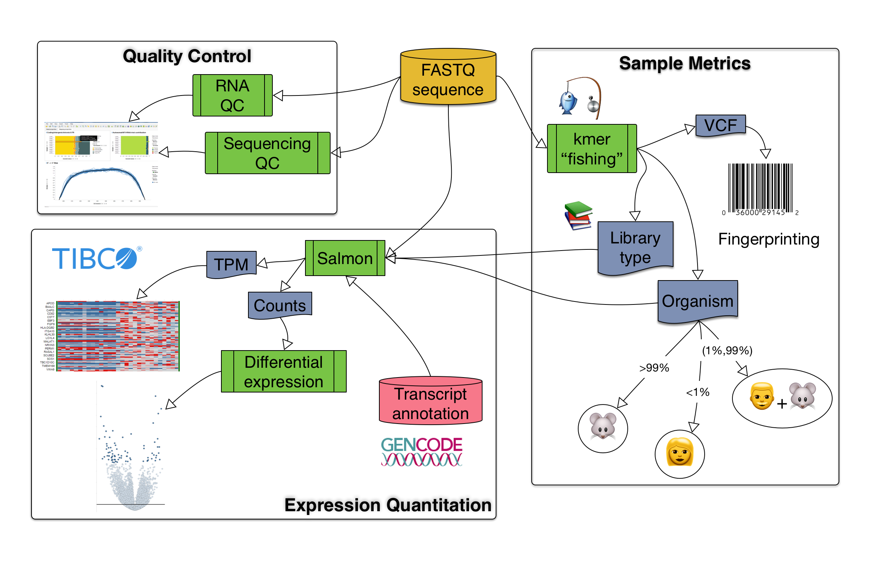

PISCES Documentation
====================

PISCES is a pipeline for rapid transcript quantitation, genetic fingerprinting,
and quality control assessment of RNAseq libraries
using `Salmon <http://github.com/COMBINE-lab/salmon>`__.

.. toctree::
   :maxdepth: 2
   :caption: Contents:

   install.rst
   data_formats.rst
   managing_metadata.rst
   running.rst
   examples.rst
   manuscript.rst

Quickstart
==========

- Install the python module (see :doc:`install`)
- Create transcriptome and genome index files (see :ref:`index_example`)
- Create a CSV file to define your experiment (see :doc:`managing_metadata`)
- Submit your jobs to a DRMAA aware high performance computing cluster (see :ref:`submit_example`)
- Summarize gene/transcript expression and QC metrics in analysis-ready tables using :ref:`summarize_example` and :ref:`qc_example`.

Publication
===========

The manuscript is under preparation and the latest version can be viewed
here: :doc:`manuscript`.

Development
===========

Pull requests and issues are welcomed on the pisces `Github repository <http://github.com/Novartis/pisces>`__.
