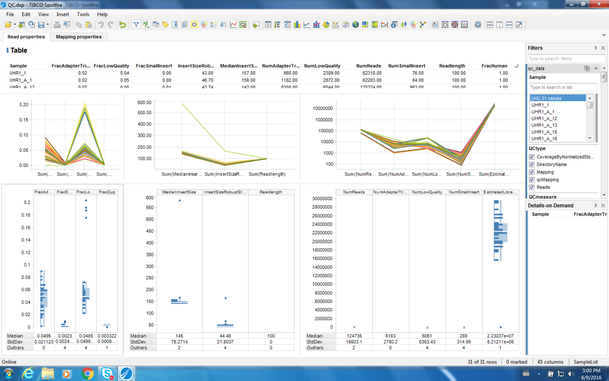
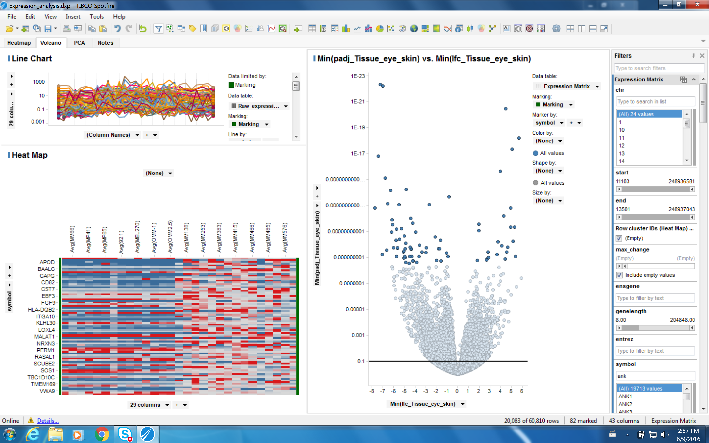

Data visualization
==================

Spotfire templates
------------------

Spotfire templates for QC and expression visualization are provided by
the ``pisces qc -t`` and ``pisces summarize -t`` options.

|QC spotfire template| |QC spotfire template| |Expression spotfire
template|

.. |QC spotfire template| image:: figures/qc_example_1.png

